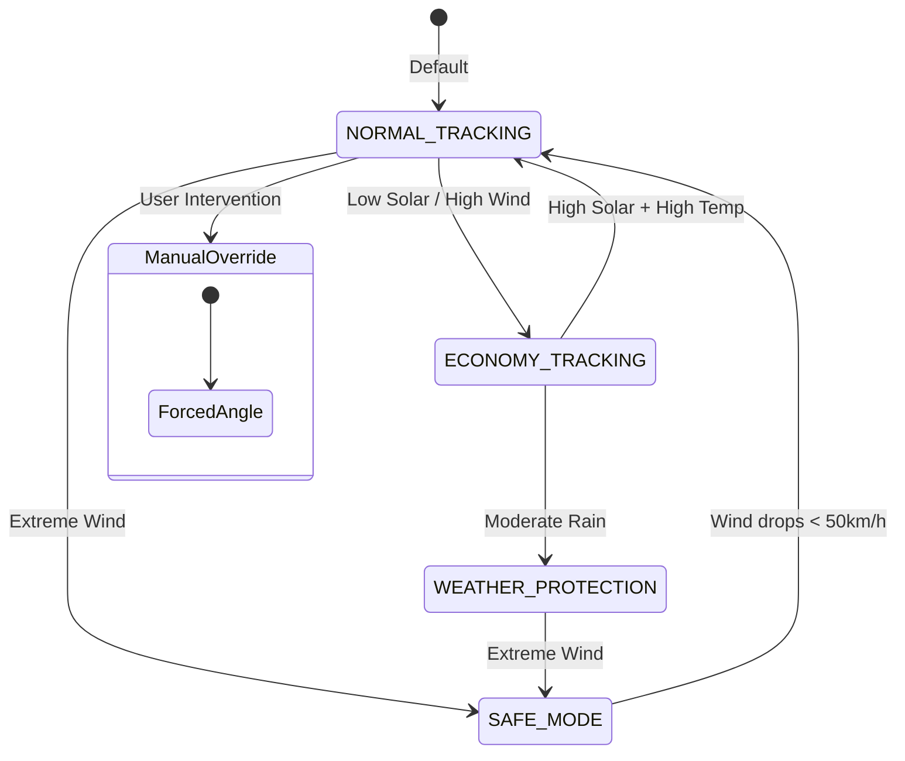

# Engineering Decision Logic & Algorithm Report
SOLIS Adaptive Façade Digital Twin

## 1. Executive Summary

### Project Purpose
The SOLIS AI Digital Twin integrates a dynamic adaptive façade with a building energy management system (BEMS) and rooftop photovoltaics (PV) to model and optimize physical and electrical interactions against real or simulated environmental data.

### Architecture Philosophy
The architecture strictly enforces separation of concerns:
- **Single Source of Truth**: Physics drives UI, never vice-versa. Environmental data is modeled once and consumed by all subsystems.
- **Pure Engineering Logic**: The AI layers observe, monitor, and predict, but NEVER manipulate or control the underlying physical engines.
- **Decoupled Engines**: E.g., the BEMS relies purely on electrical AC output from the PV Inverter, without ever recalculating DC power or solar irradiance.

### Simulation Pipeline
The orchestrated update sequence runs at ~8 Hz (throttled from 60fps), evaluating Weather → Solar Physics → Virtual Sensors → Façade Kinematics (PBIF) → PV DC/AC → Building Load → Battery → Grid.

### AI Architecture
AI is strictly layered as read-only observers:
- **Prediction Engine**: Projects state 12 hours forward.
- **What-If Engine**: Evaluates alternative configurations in a sandbox without altering live state.
- **Fault Detection Engine (FDD)**: Compares observed twin states against textbook expected behaviors.
- **Engineering Reasoning Engine**: A deterministic traversal graph interacting with the Engineering Knowledge Base.

---

## 2. Overall System Architecture

### Full Execution Order
The master loop (`simulation.ts`) ticks forward on a simulated clock. During every tick, if the environmental tier (`envDt > 0`) is resolved:
1. **Apply Weather**: Resolves Weather (`applyScenarioWeather()`).
2. **Solar Position**: Updates the absolute sun vector (`computeSun()`).
3. **Weather Interpolation**: Computes live values based on `envDt`.
4. **Solar Physics**: Computes occlusion and effective irradiance for all building surfaces and PV modules.
5. **PV DC Generation**: Aggregates DC string voltages and applies thermal derating.
6. **PV Inverter**: Converts DC to AC power, handling clipping and efficiency losses.
7. **BEMS (Building Energy)**: Re-calculates HVAC multipliers, occupancy fractions, and net load.
8. **Grid & Battery Dispatch**: Settles the surplus/deficit against battery logic and the grid bus.
9. **AI / Sensors**: Feeds deterministic snapshots into the Context Builder.
10. **Façade Control (PBIF)**: Uses sensors to update target rotations.
11. **Servo Layer**: Updates physical blade rotation easing based on mechanical lag constraints.

### Update Frequencies
- **Hot Loop (Render & Servos)**: Runs continuously (up to 60 FPS).
- **Environmental Tier**: Astronomically/physically expensive work (ray-casting, irradiance, solar angles) is throttled to roughly ~8 Hz. `envDt` tracks the true elapsed time to ensure integrations (thermal, power) remain physically accurate regardless of frame rate.

### Subsystem Dependencies & Ownership
- **Simulation**: Authoritative for `clock` (simulated time) and `building` geometry. 
- **Weather Scenario Engine**: Owns `WeatherState` (Temperature, Wind, Rain).
- **Solar Physics Engine**: Owns `AttenuatedGHI`, `IncidentAngle`, `EffectiveIrradiance`. Read-only by PV and PBIF.
- **PBIF**: Owns `operationalObjective` and `facadeState` (`CLOSED` vs `TRACKING`). Read-only by Servo engine.
- **PV Inverter**: Owns `acKW` and `efficiency`. Read-only by BEMS.
- **BEMS**: Owns `totalDemandKW` and `netLoadKW`. Read-only by Battery.

**Why this prevents duplicate calculations**: By cascading read-only references down the execution pipeline (e.g., PV Electrical relies strictly on SolarPhysics' computed `moduleEffectiveIrradiance`), no mathematical projection (like dot products or raycasts) is ever computed twice in a single tick.

---

## 3. Environmental Simulation

### Clock Synchronization
When the twin operates in Forecast Mode, the simulation clock is forced to align with the real-world site clock using `syncClockToSiteNow()`:
```typescript
const siteNow = new Date(Date.now() + building.timezone * 3_600_000)
clock.date = new Date(siteNow.getUTCFullYear(), siteNow.getUTCMonth(), siteNow.getUTCDate())
clock.timeHours = siteNow.getUTCHours() + siteNow.getUTCMinutes() / 60
lastEnergyTimeHours = clock.timeHours // Prevents thermal lag discontinuities
```

### Interpolation Algorithm (`Weather Scenario`)
Instead of step-changes, the engine computes smooth sub-hour interpolations:
```typescript
// Pseudo-code for segment interpolation
function segmentAt(series, timeHours) {
  let h = timeHours % 24;
  let curr = Math.floor(h);
  let next = (curr + 1) % 24;
  let fraction = h - curr;
  return series[curr] + fraction * (series[next] - series[curr]);
}
```

### Weather Ownership & Forecast Cache Lifecycle
The `LiveForecastEngine` handles asynchronous polling of the Open-Meteo API. It caches a 48-hour continuous array of weather parameters. Polling is blocked by a 30-minute staleness threshold to prevent API rate-limiting. Stale caches are mirrored to `localStorage`.

**Edge Cases & Failure Handling**: If the API fails or times out, the `ForecastProvider` immediately falls back to its stale cache, or gracefully interpolates the last known hourly value.

---

## 4. Cyber-Physical Façade (PBIF Specification)

### 4.1 PBIF Overview
The **Predictive Building Intelligence Framework (PBIF)** is the core intelligence of the Digital Twin’s façade.
- **Design Philosophy**: PBIF separates *strategic decision-making* from *kinematic execution*. PBIF decides **what** the building is trying to do (the Operational Objective) based on assessed weather and sensor states, while the kinematics engine and servo layer decide **how** to physically achieve it.
- **Control Objectives**: Protect the structure from extreme wind, protect the glazing from heavy rain, maximize useful daylight, minimize actuator wear, and reject extreme thermal gain.
- **Why PBIF exists**: Without PBIF, a façade would simply blindly follow the sun (or a hardcoded schedule), potentially destroying itself in high winds or baking the occupants during high summer heat. PBIF orchestrates conflicting demands.
- **Engineering Assumptions**: Assumes the local wind, rain, temperature, and irradiance sensors are reliable (though filtered). Assumes a flat-blade 180° symmetry period.
- **Relationship with the Digital Twin**: The Digital Twin simulates the environment. PBIF reads virtual sensor data (simulating physical LDRs and anemometers), classifies the situation, picks a target state, and routes it to the servo engine.

### 4.2 Complete Decision Pipeline
During every simulation update (`envDt` tick for high-level decisions, `dt` frame tick for servos), the pipeline executes as follows:

1. **Weather**: The `WeatherScenarioEngine` updates raw continuous values (`windSpeed`, `rainIntensity`, `temperature`).
2. **Solar Physics**: Computes theoretical Effective Irradiance (W/m²).
3. **Virtual Sensors**: The `VirtualSensorEngine` converts W/m² into Lux → Resistance → Voltage → 12-bit ADC (0–4095) → applies an Exponential Smoothing Filter (α).
4. **Signal Processing (Situation Assessment)**: PBIF reads the raw ADC and weather data, translating continuous variables into discrete engineering bands (e.g., `Wind = EXTREME`, `SolarResource = MEDIUM`).
5. **PBIF Decision**: The `DecisionEngine` evaluates the assessed states against a top-down declarative priority rule table to determine the `PbifState` (e.g., `ECONOMY_TRACKING`).
6. **Servo Command (Policy & Target Generation)**: The `TrackingPolicy` routes the `PbifState` to an actual target angle. If `TRACKING`, it calculates a `theoreticalTarget` from the kinematics engine, applies the dynamic deadband, and outputs `targetRotation`.
7. **Mechanical Response**: The motor applies acceleration (`rotationAcceleration`), calculates a brake speed (`sqrt(2*accel*err)`), and integrates into `rotationVelocity` considering the row lag `MECHANICAL_DELAY + rowFrac * ROW_LAG`.
8. **Facade Rotation**: `rotationAngle` updates smoothly `(commandedRotation += (target - commanded) * Math.min(1, step/delay))`.
9. **Updated Solar Exposure**: The physical angle changes `openness` and `shading`.
10. **Feedback Loop**: On the next tick, the new blade angle alters the thermal load (`surfaceTemperature = w.temperature + exposure * (10 + shading * 8)`), which closes the cyber-physical loop.

### 4.3 PBIF Operating Modes
- **NORMAL_TRACKING (Automatic Mode)**:
  - *Purpose*: Maximum solar performance.
  - *Inputs*: Solar Resource `HIGH`, Thermal Demand `HIGH` or `NORMAL`.
  - *Decision algorithm*: Fully defers to the kinematics solver to solve the optimum incident angle.
  - *Outputs*: Continuous target angle updates (`facadeState: TRACKING`).
- **ECONOMY_TRACKING**:
  - *Purpose*: Reduce actuator wear when exact tracking is unnecessary.
  - *Inputs*: Wind `HIGH`, Rain `LIGHT`, or Solar `LOW/MEDIUM`.
  - *Decision algorithm*: Track the sun, but ignore target changes smaller than a dynamic deadband (2°, 5°, or 8°).
  - *Outputs*: Updated target angle ONLY if `abs(theoretical - current) > deadband`.
- **WEATHER_PROTECTION**:
  - *Purpose*: Preserve the façade glazing from heavy rain.
  - *Inputs*: Rain `HEAVY` or `MODERATE`.
  - *Outputs*: Blades commanded to a rain-safe orientation (`RAIN_SAFE_ANGLE = 135°`). TracksSun = false.
- **SAFE_MODE**:
  - *Purpose*: Protect the actuator/structure from wind damage.
  - *Inputs*: Wind `EXTREME`.
  - *Outputs*: Blades commanded to `WIND_SAFE_ANGLE` (90° or 0° depending on configuration, presenting minimum projected area). TracksSun = false.
- **Manual Override**:
  - *Purpose*: Operator forces an angle (`setManualRotation`). PBIF automatically suspends all rules.
- **Calibration Mode**:
  - *Purpose*: Hardware sweep (0 to 180) to test servo functionality. Invoked via `maintenanceMode()`.
- **Cloud Compensation**: Not implemented. (Currently simulated as instantaneous occlusion reactions via virtual sensor drops).
- **Night Mode**: Not implemented as a distinct PBIF explicit rule, but seamlessly integrated into `autoTarget()` fallback (defaults to near-closed at 8° when `sun.isDaytime === false`).
- **Forecast-aware behaviour**: Not implemented (Currently purely reactive to real-time inputs).

### 4.4 Decision Hierarchy
PBIF evaluates rules top-to-bottom. The first match wins.
1. **Structural Safety (Priority 1)**: Wind load can physically destroy the building. Overrides everything.
2. **Weather Protection (Priority 2)**: Rain can damage the envelope. Overrides solar/thermal.
3. **Solar Availability (Priority 3)**: If the sun is blocked by thick clouds (LOW Resource), there is no point tracking it aggressively.
4. **Thermal Demand (Priority 4)**: If it is hot (HIGH Temp), we must track accurately to reject solar heat gain.

*Tie-breaking*: Because the rules are evaluated sequentially in an array, a `HIGH Wind` rule occurring at index 1 will ALWAYS short-circuit a `HIGH Temperature` rule at index 7.

### 4.5 Sensor Processing
- **LDR Acquisition**: Real irradiance (W/m²) → Lux (`W/m² * 120`).
- **Resistance Non-linearity**: `Resistance = 500 / Lux`. (Defaults to 10,000 Ω in pitch black).
- **Voltage Divider**: `Voltage = 3.3 * (10 / (Resistance + 10))`.
- **ADC Normalization**: 12-bit ADC mapping `(V/3.3) * 4095`.
- **Filtering (Noise rejection)**: An exponential smoothing filter is applied with a 0.5-second time constant to reject high-frequency noise (like a bird flying past).
  - `alpha = 1.0 - Math.exp(-dt / 0.5)`
  - `filtered = prev + (adc - prev) * alpha`
- **Signal Validation**: ADC is mathematically clamped between `0` and `4095`.
- *(Implementation Note)*: Upper/Lower pairing is simulated by treating individual modules independently in `virtualSensor.ts`. 

### 4.6 Control Algorithm
Once `targetRotation` is output by PBIF, the `AdaptiveSkinEngine` takes over to simulate mechanical reality.
1. **Target Generation**: Kinematics solver outputs `theoreticalTarget`.
2. **Deadband**: If `angularDifference > deadband`, accept theoretical target. Else, keep current target.
3. **Mechanical Lag**: A delay is computed based on the panel's row (`ROW_LAG`). `delay = MECHANICAL_DELAY + rowFrac * ROW_LAG`.
4. **Smoothing**: `commandedRotation += (targetRotation - commandedRotation) * Math.min(1, step / delay)`.
5. **Servo Physics**:
   ```typescript
   const err = commandedRotation - rotationAngle;
   const dir = Math.sign(err);
   const brakeSpeed = Math.sqrt(2 * accel * Math.abs(err)); // decel to arrive at rest
   const desired = dir * Math.min(speedCap, brakeSpeed);
   const dv = clamp(desired - rotationVelocity, -accel * dt, accel * dt);
   rotationVelocity += dv;
   rotationAngle += rotationVelocity * dt;
   ```
6. **Angle Clamping / Saturation**: The final angle is strictly clamped to `[0, 180]`.

### 4.7 Threshold Tables
| Parameter | Value | Units | Purpose | Source / Justification |
|-----------|-------|-------|---------|------------------------|
| `WIND_MODERATE` | 20 | km/h | Edge for Light wind | Beaufort scale loosely adapted |
| `WIND_HIGH` | 35 | km/h | Edge for Economy tracking | Protects against strong breezes |
| `WIND_EXTREME` | 50 | km/h | Edge for SAFE_MODE | Near-gale force, structural risk |
| `RAIN_HEAVY` | 0.65 | norm | Edge for WEATHER_PROTECTION | Intense precipitation |
| `ADC_HIGH` | 4000 | bit | High solar resource | Bright direct sunlight (near saturation) |
| `ADC_MEDIUM` | 2000 | bit | Medium solar resource | Overcast/diffuse light |
| `TEMP_HIGH` | 30 | °C | High thermal demand | Triggers aggressive heat rejection |
| `DEADBAND_HIGH` | 2 | ° | Tracking deadband | Tight tracking when resource is high |
| `DEADBAND_LOW` | 8 | ° | Economy deadband | Loose tracking to save motors |

### 4.8 State Machine


### 4.9 Failure Handling
- **Sensor Disagreement / Invalid values**: If irradiance evaluates to `NaN` or `0`, Lux evaluates to 0, Resistance caps at 10,000 Ω, ADC drops to near 0, evaluating safely as `LOW` solar resource, sending the façade into `ECONOMY_TRACKING` rather than erratic swinging.
- **Simulation Pause / Clock Scrub**: A clock scrub sets `dt <= 0`. The servo motor explicitly requires `dt > 0` to integrate acceleration (`accel * dt`). A scrub instantly freezes `rotationVelocity` to `0`, ensuring mathematical stability without NaN integration errors.
- **Night-time**: Sun drops below horizon; `isDaytime` becomes false. Irradiance calculates to 0. ADC drops to 0. `LOW` Solar Resource triggers `ECONOMY_TRACKING`, but base logic forces angle to `8°` to close for the night.
- **Forecast Unavailable**: Weather falls back to the last known hourly value; PBIF degrades gracefully to whatever the fallback values are.
- **Mechanical Limits**: Angles are mathematically bounded; if a calculated target is `190°`, it is clipped to `180°` before entering the velocity integrator.

### 4.10 Worked Examples

**Example 1: Sunny Morning**
- *Input*: Wind 10km/h, Rain 0, ADC 4050 (High Sun), Temp 25°C.
- *Sensor values*: Wind=LOW, Rain=NONE, Solar=HIGH, Temp=NORMAL.
- *Decision process*: Top-down rules pass until `Default -> NORMAL_TRACKING`.
- *Target angle*: Kinematics solver outputs 45°.
- *Final blade rotation*: Servos accelerate toward 45°, arriving smoothly without overshoot.

**Example 2: Sudden Gale (Extreme Wind)**
- *Input*: Wind spikes to 65km/h.
- *Decision process*: Rule 1 triggers (`EXTREME wind -> SAFE_MODE`).
- *Target angle*: `WIND_SAFE_ANGLE` (0° closed).
- *Final blade rotation*: Blades override all tracking and shut flat to the façade to minimize projected area.

**Example 3: Overcast (Heavy Cloud)**
- *Input*: ADC drops to 1500 (LOW Solar Resource), Temp 28°C.
- *Decision process*: Rule triggers `LOW Solar Resource -> ECONOMY_TRACKING`.
- *Target angle*: Deadband set to 8°. Sun moves 3°. `angularDifference (3) < deadband (8)`. Target remains unchanged.
- *Final blade rotation*: Blades hold position, saving actuator wear.

**Example 4: Rain**
- *Input*: Rain spikes to 0.70 (HEAVY), Wind 25 km/h (MODERATE).
- *Decision process*: Rule 3 triggers (`HEAVY rain -> WEATHER_PROTECTION`).
- *Target angle*: `RAIN_SAFE_ANGLE` (135°).
- *Final blade rotation*: Blades rotate outwards to actively shed water off the glazing.

**Example 5: Night**
- *Input*: Sun elevation < 0. Irradiance = 0.
- *Decision process*: PBIF assigns `ECONOMY_TRACKING` due to LOW Solar Resource, but `AdaptiveSkin` resolves `autoTarget` to 8° because `sun.isDaytime === false`.
- *Final blade rotation*: Servos rotate to a near-closed 8° security posture.

### 4.11 Engineering Validation
- **Physical Reasonability**: The sensor model accurately reflects a real ESP32 micro-controller reading an analog LDR voltage divider, including the non-linear Lux-to-Resistance response. The mechanical servo model properly accounts for inertia (acceleration/deceleration) rather than teleporting blades.
- **Known Assumptions**: Wind is uniform across the entire façade. Rain intensity is abstract (0-1) rather than mm/hr. 
- **Simplifications**: The thermal demand state relies purely on outdoor dry-bulb temperature, omitting humidity (enthalpy) and internal occupancy heat gains.
- **Future Extension Points**: Connecting the `CloudModificationFactor` directly to an MPC (Model Predictive Control) horizon to preemptively open/close blades before a cloud arrives, rather than reacting via LDR after the shadow falls.

---

## 5. Solar Physics

### Complete Irradiance Algorithm
Solar Physics is the absolute authority on daylight, irradiance, and geometric obstruction.

**Cosine Projection**:
```typescript
const cosProj = clamp(dot(sun.worldDir, p.normal), 0, 1)
const incidentAngleDeg = Math.round(rad2deg(Math.acos(cosProj)))
```
**Occlusion (Neighbor Shading)**:
Uses Axis-Aligned Bounding Box (AABB) intersection against neighbor geometries. Returns `1.0` if unobstructed, `0.0` if shaded.

**Irradiance Model**:
```typescript
const diffuseSky = ghi * DIFFUSE_SKY_FRACTION // Constant 15%
const direct = isDaytime ? ghi * cosProj * occlusionFactor : 0
const effectiveIrradiance = Math.round(direct + diffuseSky)
```
**Failure Cases**: Nighttime automatically clamps `isDaytime` to false, ensuring direct beam calculations immediately drop to `0`.

---

## 6. PV System

### Placement Algorithm & Module Iteration
The PV layout is statically initialized inside the roof bounds matching the `BuildingConfig`. 
Strings are iterated over linearly. Each module maps its globally unique ID to the `SolarPhysicsEngine`'s effective irradiance table.

### PV Inverter Conversion & Clipping
The Inverter maps total aggregated DC kW to AC kW.
```typescript
// Offline/Standby handling
if (dcInputKW <= INVERTER_STANDBY_KW) {
    return { acKW: 0, lossKW: dcInputKW, state: 'Standby' }
}

const theoreticalACPower = dcInputKW * INVERTER_BASE_EFFICIENCY

// Clipping Logic
if (theoreticalACPower > INVERTER_RATED_CAPACITY_KW) {
    return {
        acKW: INVERTER_RATED_CAPACITY_KW,
        lossKW: dcInputKW - INVERTER_RATED_CAPACITY_KW,
        efficiency: INVERTER_RATED_CAPACITY_KW / dcInputKW,
        state: 'Clipping'
    }
}
```

---

## 7. Building Energy

### Load Calculation & Occupancy Profile
Load is calculated based on Commercial Office peak densities (e.g. HVAC = 22 W/m²). Occupancy scales these peak densities.
**Occupancy Smoothing (C¹-Continuous)**:
Uses `smoothstep` to model arrival, departure, and a "lunch dip" to eliminate non-physical step-changes.
```typescript
const arrived = smoothstep(6.5, 8.5, h)
const left = 1 - smoothstep(17.0, 19.5, h)
const lunch = 1 - 0.25 * bump(h, 12, 13.5)
const occupancy = clamp(arrived * left * lunch)
```

### HVAC Thermal Lag
HVAC models the degree-hour above a 24°C balance point. Fabric thermal lag is explicitly simulated with a 15-simulated-minute time constant so it rejects high-frequency weather noise.
```typescript
const excess = smoothstep(24, 34, outdoorTempC)
const equilibrium = 0.55 + (1.0 - 0.55) * excess
```

### Battery Dispatch & Grid Balancing
The Battery evaluates net bus `surplus` or `deficit`.
```typescript
// Charge Logic
const headroomKWh = Math.max(0, capacityKWh - storedKWh)
const headroomLimitKW = headroomKWh / (chargeEfficiency * dtHours)
const chargeKW = Math.min(surplusKW, maxPowerKW, headroomLimitKW)

// Discharge Logic
const reserveKWh = capacityKWh * reserveFraction
const availableKWh = Math.max(0, storedKWh - reserveKWh)
const availableLimitKW = availableKWh * dischargeEfficiency / dtHours
const dischargeKW = Math.min(deficitKW, maxPowerKW, availableLimitKW)
```
**Failure Handling**: If simulated time `dtHours <= 0` (e.g. clock scrub/rewind), the battery gracefully parks in an 'Idle' state to prevent temporal continuity errors.

---

## 8. AI Systems

### Prediction Engine
- **Purpose**: Evaluates 12 hours ahead in hourly steps.
- **Algorithm**: Deep clones a `SimSnapshot`. Iterates `t + 1` through `t + 12`, executing pure stateless logic blocks (`hvacDemandFactor`, `planStorage`, `planeIrradiance`).
- **Constraints**: It assumes the façade remains physically locked in its current geometry to project base-case solar gains.

### What-If Sandbox
- **Behavior**: Forks the twin configuration parameters (e.g. modifies Battery Capacity or PV string lengths), runs a single `projectWalk`, and returns the variance curve.
- **Update Frequency**: On-demand (User-triggered). Destructs immediately after calculation.

### Context Builder & Reasoning Engine
- **Inputs**: Extracted physical parameters mapped to high-level diagnostic concepts (e.g., "Battery state", "Façade mode").
- **Algorithms**: Uses a deterministic traversal graph referencing `EngineeringKnowledgeBase`. Maps boolean truth statements into UI-readable logic chains.
- **Failure Handling**: If an unexpected string is received, fails over to "Unknown state, assuming manual override."

### Fault Detection (FDD)
- **Algorithm**: Compares physical properties (like Inverter AC Output vs theoretical Solar Irradiance).
- **Rule Example**: `if efficiency > 1.0 (100%) -> Alert: Implausible Conversion`.

---

## 9. Decision Logic (Tables & Thresholds)

### PBIF Decision Table
| Priority | Condition | Threshold / Value | Objective | Action |
|----------|-----------|-------------------|-----------|--------|
| 1 | Wind Extreme | > 50 km/h | Structural Safety | SAFE_MODE (0°) |
| 1 | Wind High | > 35 km/h | Structural Safety | ECONOMY_TRACKING |
| 2 | Rain Heavy | > 0.65 intensity | Weather Protection | WEATHER_PROTECTION (0°) |
| 3 | Solar Low | < 2000 ADC | Solar Availability | ECONOMY_TRACKING (8° deadband) |
| 4 | Temp High | > 30°C | Thermal Demand | NORMAL_TRACKING |

---

## 10. Mathematical Models

- **Attenuated GHI (W/m²)**
  - *Equation*: `GHI_ClearSky * CloudModFactor`
  - *Physical Meaning*: Global horizontal irradiance reduced by current cloud cover.

- **Plane Irradiance (W/m²)**
  - *Equation*: `(GHI * CosProj * Visibility) + (GHI * 0.15)`
  - *Assumptions*: Diffuse sky fraction is constant at 15%. Visibility is binary (0 or 1) based on center-point raycasting.

- **Thermal HVAC Multiplier**
  - *Equation*: `0.55 + 0.45 * smoothstep(24, 34, TempC)`
  - *Assumptions*: Below 24°C, building only supports ventilation/internal gains (55% base HVAC load). Above 34°C, cooling reaches 100% capacity.

- **Battery Charge Headroom Limit (kW)**
  - *Equation*: `headroomKWh / (chargeEfficiency * dtHours)`
  - *Physical Meaning*: The maximum continuous AC power the battery can accept before becoming perfectly full over the timestep `dtHours`.

---

## 11. AI Reasoning Flow

### Reasoning Graph Lifecycle
1. **Question Trigger**: User interacts with Assistant UI.
2. **Intent Classification**: Evaluates if the query is diagnostic, predictive, or navigational.
3. **Context Retrieval**: Assistant extracts `SimSnapshot` via ContextBuilder.
4. **Knowledge Retrieval**: Assistant reads `EngineeringKnowledgeBase` (Static files) to cross-reference rules.
5. **Prompt Builder**: Formats the physical snapshot + static knowledge into a structured JSON prompt for Gemini.
6. **Gemini Interaction**: LLM generates deterministic layout and logic map based *strictly* on prompt boundaries.
7. **Response Generation**: Renders as actionable UI cards (e.g. clicking a widget navigates the camera to the PV inverter).

---

## 12. Performance Architecture

### Zero-Allocation Strategy
The critical path avoids object allocations during the hot loop (`dt` frame ticks). `sunVector`, `neighbors`, and `moduleEffectiveIrradiance` are reused maps or statically typed mutable vectors.

### Environmental Throttling
Heavy calculations (Raycasting via `neighborOcclusion`, Open-Meteo cache evaluations) only execute when `envDt` trips the accumulator. This allows visual rendering to proceed at 60 FPS while physics strictly step at 8 FPS.

### Clock Integrity
Scrubbing the timeline backwards or jumping days calculates `dtHours > 1` or `< 0`. The architecture intercepts these discontinuities, clamping integrations to `0` so batteries and thermal mass do not integrate "time travel."

---

## 13. Subsystem Algorithm Specifications

### Solar Physics Engine
- **Purpose**: Computes geometry, occlusion, and irradiance for all 3D physical elements.
- **Internal Variables**: `moduleIncidentAngle`, `moduleCosineProjection`, `moduleOcclusion`.
- **Edge Cases**: When the sun dips below the horizon (`isDaytime = false`), direct beam multipliers immediately null to `0.0`.

### PBIF Controller
- **Purpose**: Decide operational state.
- **Algorithm**: Iterate rules array top-to-bottom. First valid condition sets state.
- **Computational Complexity**: O(N) where N is number of rules (currently < 10, executing in microseconds).

### Battery Energy
- **Purpose**: Accumulate/Dispatch surplus power.
- **Edge Cases**: Evaluates to `Idle` instantly if `surplusKW < 0.01` (10 Watts).

---

## 14. Cross-Subsystem Interaction

The pipeline acts as a physical cascading river, enforcing a strict acyclic dependency graph:
**Weather Scenario** → Updates Wind, Sun, Clouds.
↓ (Read by)
**Solar Physics Engine** → Computes GHI and Irradiance.
↓ (Read by)
**PV Electrical** → Converts Irradiance to DC Power.
↓ (Read by)
**PV Inverter** → Converts DC Power to AC Power.
↓ (Read by)
**Building Energy (BEMS)** → Subtracts AC Power from Building Load to find Deficit.
↓ (Read by)
**Battery Storage** → Absorbs/Supplies Deficit.

**Why this matters**: If the user manipulates the weather via a UI widget, the cascade guarantees that the Battery's state of charge reacts perfectly synchronously downstream. There are zero race conditions.

---

## 15. Engineering Validation

- **Is the HVAC Model reasonable?** Yes. Relying on degree-hours above a balance point (24°C) represents standard CIBSE/ASHRAE first-order energy models.
- **Current Simplifications**: PV shading assumes complete blockage (Visibility `0` or `1`); partial string degradation is not currently modelled. Battery temperature derating is pinned to a factor of `1.0`.
- **Future Improvements**:
  - Dynamically linking PBIF façade angle to HVAC cooling demand to close the thermal-gain loop.
  - Introducing financial grid tariffs and Time-Of-Use evaluation.
  - Adding realistic battery capacity degradation based on `throughputKWh`.
