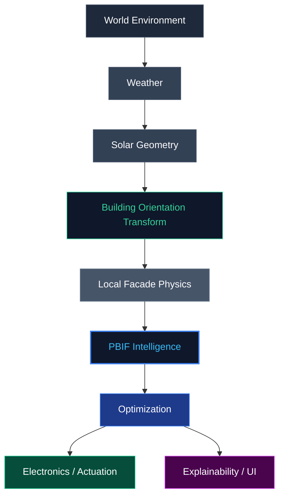

# PBIF Engineering Guide

Welcome to the **Predictive Building Intelligence Framework (PBIF)** project. 

This document serves as the **authoritative engineering constitution** for all human and AI contributors. Before making any code modifications, creating new files, or proposing architectural changes, you **must** read and understand this guide.

---

## 1. Project Overview

### Vision
To revolutionize sustainable building design by creating an intelligent, predictive, and adaptive façade system powered by real-time environmental data and optimization algorithms.

### Competition Objective
To deliver a world-class, competition-winning digital twin and physical prototype that demonstrates advanced engineering, physics simulation, and decision intelligence.

### Research Contribution
To bridge the gap between static building automation and dynamic, predictive intelligence, providing measurable improvements in energy efficiency, visual comfort, and thermal regulation.

### Scope
The project encompasses a complete hardware-software ecosystem:
1. **Digital Twin Platform (React/Three.js)**: A physically accurate simulation of the building and its environment.
2. **PBIF Optimizer**: The intelligence engine that predicts and decides optimal façade behaviors.
3. **Hardware (ESP32/Wokwi)**: The physical actuation of the adaptive façade based on digital twin commands.

---

## 2. PBIF Philosophy

Every line of code and architectural decision must align with the following core principles:

- **Physics Before AI**: The foundation of the system is rooted in established physics (e.g., solar geometry, irradiance). Do not rely on AI "magic" or arbitrary approximations when a scientific formula exists.
- **Digital Twin First**: The digital twin is not a dashboard; it is a live, rigorous simulation. The physical hardware follows the twin, not vice versa.
- **Explainability**: Every calculation, environmental metric, and optimization decision must be fully explainable and traceable. The system must educate the user on *why* a decision was made. Every future PBIF calculation must be mathematically traceable and explainable in the exact same manner.
- **Scientific Accuracy**: Use established scientific models (e.g., Meeus astronomical algorithms, ASHRAE Clear Sky model).
- **Modularity**: Strict separation of concerns. Physics calculations must not be tangled with UI rendering or React state.
- **Progressive Validation**: Features are built, validated against reality (e.g., Weather Validation Mode), and then integrated into the larger optimization loop.

---

## 3. Current Development Stage

**Phase: Weather & Solar Validation Mode** _(status updated 2026-07-23)_

- **Active Systems**:
  - Environmental Engine — NOAA/Meeus solar position, ASHRAE Clear-Sky irradiance, WHO/WMO UV Index, weather.
  - Digital Twin 2.5D Rendering (Three.js/Fiber) — the building is now a **Double-Skin Kinetic Façade** (curtain wall + air cavity + centre-pivot aluminium fins).
  - **Façade Kinematics geometry engine** (`src/lib/kinematics/`) — a pure Sun-vector → panel-rotation model.
  - **Three façade control modes** (Manual · Sun-Tracking · **PBIF**) sharing ONE renderer + animation pipeline (`src/lib/engine/facadeControl.ts`).
  - **PBIF Version 1** (`src/lib/pbif/`) — the first, deterministic decision-making layer: weather → situation assessment → decision → tracking policy → existing kinematics. See §15.
  - Educational UI overlays (progressive disclosure) — Solar Geometry inspector, world Orientation compass, Panel Kinematics inspector, PBIF Decision panel, active-surface highlight.
- **Temporarily Disabled Systems** (feature-flagged `WEATHER_VALIDATION_MODE`, never deleted):
  - The full PBIF multi-objective **optimization** loop, predictive intelligence, MPC (PBIF v1 above is deterministic rule-based only — no AI/prediction/optimization).
  - Virtual Embedded Controller / Electronics / Explainability layers.
  - The fault framework and the servo/inertia motor model.
- **Developer Focus**:
  - Keep the environmental and kinematic models mathematically flawless and fully cited.
  - Maintain a clean, professional, "engineering-grade" visualization.
  - Do NOT re-enable PBIF optimization until the foundation is validated.

---

## 4. Overall Architecture

The system follows a strict, unidirectional data and logic flow:



### Layer Responsibilities
- **World Environment & Weather**: Generates real-time ambient conditions in fixed world space (temperature, cloud cover, wind).
- **Solar Geometry**: Calculates rigorous astronomical sun positions, fixed entirely in world coordinates. Do NOT artificially rotate the sun.
- **Building Orientation**: Pure coordinate transformation layer. Rotates the incoming world-space environmental vectors into the building's Local Coordinate System based on its heading.
- **Local Facade Physics**: Computes the physical impact on the building skin. Operates entirely in Local Space.
- **PBIF**: Evaluates the physical state against building objectives (e.g., minimize cooling, maximize daylight).
- **Optimization**: Resolves conflicting objectives to determine the exact target angle for the adaptive panels.
- **Electronics**: Translates target angles into hardware signals (ESP32/Servos).
- **Explainability**: Surfaces the math, logic, and telemetry to the user interface in an educational manner.

---

## 5. Development Workflow

Before writing code, execute the following workflow:

1. **Understand the Objective**: Read the prompt or issue fully. Do not rush to implementation.
2. **Read this Guide**: Ensure your proposed solution aligns with the project philosophy.
3. **Inspect Existing Implementation**: Use `grep` or `view_file` to thoroughly search the codebase. **Reuse existing architecture** whenever possible.
4. **Avoid Duplicate Implementations**: Do not recreate utility functions, UI panels, or math models that already exist.
5. **Design Before Coding**: For complex tasks, outline your mathematical models and architectural changes.
6. **Validate Mathematically**: Ensure your logic is scientifically sound.
7. **Implement & Test**: Write clean, modular code. Check for regressions.
8. **Summarize Changes**: Provide clear, concise commit/PR descriptions explaining the *why* alongside the *what*.

---

## 6. Coding Standards

- **One Responsibility Per Module**: Do not mix math logic into React components. Physics goes in `src/lib/engine/`. UI goes in `src/components/`.
- **No Magic Numbers**: All constants must be extracted, named clearly, and ideally cited with a comment (e.g., `const SOLAR_CONSTANT = 1361 // W/m²`).
- **No Duplicated Utilities**: Search `src/lib/` before writing new helper functions.
- **Prefer Vector Mathematics**: Use `THREE.Vector3` or established linear algebra patterns for spatial calculations. Avoid messy trigonometric workarounds.
- **Scientific References Required**: When implementing a physical formula, cite the source in the JSDoc (e.g., "Source: ASHRAE Fundamentals 2021").
- **Maintain Future Compatibility**: When operating in Validation Mode, do not delete PBIF code. Use feature flags (e.g., `WEATHER_VALIDATION_MODE`) to cleanly separate current testing from future capabilities.

---

## 7. Digital Twin Principles

The Digital Twin is not built all at once. It evolves progressively:

1. **Geometry & Environment**: Establish the building massing and accurate solar/weather parameters.
2. **Physics**: Apply the environment to the geometry to calculate raw physical impact (heat, light).
3. **Kinematics**: Build the mechanical model of the adaptive skin (blade rotation, limits).
4. **PBIF**: Introduce the predictive intelligence to govern the kinematics based on the physics.
5. **Hardware Integration**: Sync the fully simulated environment with the physical Wokwi/ESP32 prototype.
6. **Explainability**: At every step, the UI must explain *how* the simulation is reaching its conclusions.

---

## 8. Digital Twin Scene Graph Principles

The Digital Twin explicitly distinguishes three different spatial layers, reflecting best practices in CAD, BIM, and game engines. This hierarchy ensures that orientation, physics, and kinematics remain completely decoupled from the fixed environment.

### 8.1 The Layer Hierarchy

```text
World Space (Stationary)
│
├── Sun
├── Sky
├── Ground
├── Roads
├── Trees
├── Neighbour Buildings
├── Compass (World North)
│
└── Main Building Node (Receives Building Orientation Transform)
      │
      ├── Structural Components
      ├── Glass Curtain Wall
      ├── Air Cavity
      ├── Adaptive Façade
      │
      └── Façade Local Space
            ├── Surface Normals
            ├── Panel Rotation Axes
            ├── Panels
            └── Panel Debug Objects
```

### 8.2 Scene Graph Rules

1. **World Objects Never Inherit Building Transforms**: The surrounding environment (neighbors, sun, compass, trees) must always sit in the root `World Space`. They must never inherit or manually apply the building's orientation.
2. **Building-Mounted Components Always Inherit**: The glass curtain wall, core geometry, adaptive façade, and any associated debug visualizations must sit *inside* the `Main Building Node`. They will naturally inherit the orientation transform.
3. **Hierarchy Over Math**: Never manually synchronize transforms across separate nodes (e.g. rotating the roof and the glass independently). Let the parent-child scene graph do the work. The building orientation transform is applied **exactly once** at the `Main Building Node`.
4. **AI Contributor Guidelines**:
   - When introducing new building-mounted objects (e.g., roof HVAC, interior sensors), attach them beneath the `Main Building` node.
   - When introducing environmental objects (e.g., cars, clouds), attach them beneath the `World` root.
   - **Never rotate the entire scene to simulate building orientation.**

---

## 9. Panel Kinematics Explainability

The kinematics and rendering layers of the digital twin must serve as an educational tool for the user. When implementing or modifying visual debugging panels (such as the `KinematicsInspector`):

1. **Traceability**: All displayed quantities must be mathematically traceable. Do not show magic numbers.
2. **Mathematical Sourcing**: Every engineering value must have a documented mathematical source, equation, and explanation (e.g. `acos(n̂ · ŝ)` for Incident Angle).
3. **Engineering Education**: Debug visualizations should support engineering education, not just software debugging. Label arrows explicitly (e.g. using HTML floating text) and explain *why* angles are chosen (e.g., shortest-path rotation, symmetry, maximizing interception).
4. **Conditional Accuracy**: Debug visualizations must accurately represent the current physical state of the simulation. Sun-dependent debug visualizations (e.g., solar vectors, projected shadows, and their labels) must be conditionally rendered and should only appear when a valid solar vector exists (i.e., during daytime).
5. **Scientific Citations**: Scientific references (e.g., NOAA solar models, Rodrigues' Rotation Formula) must accompany implemented equations whenever practical within the UI.

---

## 10. User Interface Principles

The digital twin must feel like a premium, professional engineering tool (akin to Autodesk Forma, Unreal Engine, or ArcGIS). 

- **Progressive Disclosure**: Do not overwhelm the user. Hide complex data behind expandable panels, inspector modals, or tabs.
- **The Building is the Hero**: The 3D visualization is the centerpiece. The UI should float cleanly over the canvas without obstructing the view.
- **Engineering Visualization**: Use data visualization (heatmaps, vectors, charts) over plain text when possible.
- **Minimal Clutter**: Maintain high contrast, clean typography, and consistent spacing. Avoid visual noise. Related controls (e.g., Building Orientation and Geometry) must be integrated into a single configuration panel rather than fragmented into standalone components.
- **Educational Interface**: Provide tooltips, inline citations, and explicit formulas to teach the user how the metrics are derived.

---

## 11. AI Contributor Rules

As an AI assistant (Claude, Gemini, etc.), you are bound by these strict constraints:

1. **Modify Before Creating**: Always attempt to modify existing files before generating new ones. Never create duplicate pages or redundant components.
2. **Never Redesign Architecture Without Justification**: If you believe a refactor is necessary, explain *why* and seek approval. Do not silently rewrite core systems.
3. **Preserve PBIF Compatibility**: Do not permanently delete optimization logic just because it is temporarily disabled.
4. **Explain Engineering Reasoning**: Your responses must include the mathematical or architectural reasoning behind your code changes.
5. **Cite Scientific Sources**: When implementing physics or environmental features, you must cite real-world sources in the code comments.
6. **Keep Implementations Modular**: Strictly enforce the boundary between `src/lib/engine/` (pure logic/math) and `src/components/` (React/UI).

---

## 12. Future Roadmap

1. **Current** — Weather & Solar Validation Mode. ✅ Environmental models (NOAA solar, ASHRAE irradiance, WHO UV) validated & cited; educational UI in place. Ongoing: polish.
2. **Kinematics** — Re-enable Façade Kinematics. ✅ Pure geometry engine (`src/lib/kinematics/`) built & mathematically validated; centre-pivot blade rendering + shading vectors verified; Manual + Sun-Tracking control modes share one renderer/pipeline.
3. **PBIF v1 (current)** — ✅ First decision layer live. A deterministic, rule-based PBIF (`src/lib/pbif/`) plugs into the `resolveTargetRotation()` control-source seam as the third mode. It reads three weather variables (cloud, rain, wind), assesses them into engineering states, and chooses an operational objective by a strict priority hierarchy; the existing kinematics engine still computes every rotation. See §15.
4. **Mid-term (next)** — PBIF v2+. Replace the deterministic decision *source* with predictive / AI / multi-objective optimization / MPC, supplying a real confidence value. The Situation Assessment, Tracking Policy, kinematics engine, and PBIF Decision UI stay unchanged — only the decision source is swapped.
5. **Long-term** — Hardware in the Loop (HIL). Connect PBIF to the physical ESP32/Wokwi prototype for bidirectional control and telemetry.

---

## 13. Definition of Done

Before submitting a change, ensure it passes this checklist:

- [ ] Does the change adhere to the "Physics Before AI" philosophy?
- [ ] Are all scientific formulas properly cited in the source code?
- [ ] Is the code modular (logic separated from UI)?
- [ ] Have all magic numbers been eliminated or properly documented?
- [ ] Does the UI maintain a professional, uncluttered engineering aesthetic?
- [ ] Is progressive disclosure utilized for any new dense data sets?
- [ ] Does the change maintain compatibility with the future PBIF roadmap?
- [ ] Have you explained your engineering reasoning in your response?

---

## 14. Implementation Progress Log

> A running record of validated work, newest first. Everything below is gated by
> `WEATHER_VALIDATION_MODE`; no PBIF/optimization/electronics code was deleted.

### 2026-07-23 — Virtual Embedded Controller Circuit Redesign
- **`src/components/embedded/CircuitSimulation.tsx`** — Completely redesigned from a literal hardware mockup into a professional, layered architectural diagram.
- **Top-Down Topology**: Separated into three distinct horizontal zones (Input Devices, Controller, Output Devices) to clearly communicate signal flow and hardware hierarchy.
- **Orthogonal Wire Harnesses**: Eliminated visual spaghetti by routing all signals through bundled horizontal "signal buses" using 90-degree orthogonal traces, mimicking professional PCB/schematic routing.
- **Visual Polish**: Upgraded all SVG modules (LDR, PIR, DHT22, Servo, LCD, etc.) to feature realistic electronics textures, proper pinouts, and a 5:4 aspect ratio engineering grid layout.

### 2026-07-23 — PBIF Version 1 (deterministic decision layer)
- **`src/lib/pbif/`** — a new, self-contained, framework-free decision package: `situationAssessment.ts` (raw weather → engineering states), `decisionEngine.ts` (ordered priority-ranked rule table → operational state + reason + priority + confidence + rule id), `trackingPolicy.ts` (decision → façade behaviour + per-surface target, routed through the existing kinematics solver), `thresholds.ts` (all tunable constants + safe orientations), `index.ts` (`evaluatePbif`).
- **Third façade control mode.** `FacadeControlMode` gains `'pbif'`; `facadeControl.ts`'s `resolveTargetRotation` switch adds a `case 'pbif'` that calls the Tracking Policy. PBIF never returns a panel angle — it decides the policy; the kinematics engine (unchanged) computes every rotation.
- **Engine integration.** `AdaptiveSkinEngine.update()` computes ONE building-global `PbifEvaluation` per tick from `{windSpeed, rainIntensity, cloudCoverage}` and passes the decided state into the per-surface target resolver. Exposed to the UI via `getPbifEvaluation()`.
- **UI.** `ControlDeck` façade-control selector is now Manual · Sun Tracking · PBIF. New `PbifPanel` (right rail, shown only in PBIF mode) renders the full explainable chain — Weather → Situation Assessment → PBIF Decision → Tracking Policy → Kinematics Solver → Current Façade Behaviour — with reason, priority, rule triggered and confidence.
- Decision logic validated against the four canonical cases (EXTREME wind → SAFE_MODE, HEAVY rain → WEATHER_PROTECTION, OVERCAST → ECONOMY_TRACKING, benign → NORMAL_TRACKING). Deterministic, rule-based, 100% confidence by construction. **No AI, ML, prediction, optimization or MPC.** Full spec in §15.

### 2026-07-23 — Two façade control modes, one pipeline
- **`src/lib/engine/facadeControl.ts`** — `resolveTargetRotation(mode, input)`, the single *source of target rotation* abstraction. `FacadeControlMode = 'manual' | 'sun-tracking'`; future **PBIF / ESP32 / fault** sources become new `case`s with **zero** renderer changes.
- **`adaptiveSkin.ts`** resolves ONE target per surface and eases every blade toward it identically (`TARGET_EASE_RATE`) — both modes share the renderer + animation pipeline; only the target *source* differs. Renderer (`FacadeLayer`) still consumes only `panel.rotationAngle`.
- **UI** (`ControlDeck`): Manual / Sun-Tracking selector; progressive-disclosure tracking-intent (Shade/Daylight) shown only under Sun-Tracking; manual slider shown only in Manual.

### 2026-07-23 — Façade kinematics geometry engine
- **`src/lib/kinematics/`** (VectorMath · SolarVector · FacadeSurface · IncidentAngle · PanelKinematics · RotationSolver) — pure, dependency-free Sun-vector → panel-rotation geometry. No PBIF, no weather, no time-of-day rules.
- Result: strategies A≡B≡C≡E (track the sun) vs D (edge-on); interception ceiling `cos(altitude)`; flat-blade 180° symmetry → shortest-path continuous 360° rotation. Numerically validated across a Kuala Lumpur day. Docs: **`src/lib/kinematics/KINEMATICS.md`**.
- Visualization: `KinematicsInspector` (explains *why* a blade rotated), `KinematicsDebug` (3D solar / surface-normal / panel-normal / axis / shadow vectors).

### 2026-07-23 — Solar position upgraded to NOAA/Meeus
- **`src/lib/engine/solarPosition.ts`** — NOAA Solar Calculator methodology (Meeus, *Astronomical Algorithms*). True-north-referenced and building-independent (world coords → solar model → building orientation offset → façades). Docs/citations: **`src/lib/engine/SOLAR_MODEL.md`**. The legacy simplified model in `simulation/algorithms.ts` is left intact for the ESP32/PBIF layer.
- **`OrientationOverlay`** world compass added; building-orientation removed from the Solar Geometry panel (no duplication).

### 2026-07-22 — Weather Validation Mode + environmental models
- **`WEATHER_VALIDATION_MODE`** flag disables (not deletes) faults, PBIF/VEC/servo and the Decision/Electronics/Explainability layers.
- Irradiance: **ASHRAE Clear-Sky (τb/τd)**; UV Index: **WHO/WMO** — both cited in `solar.ts`.
- Educational overlays: Solar Geometry inspector, active-surface highlight, simplified weather/solar metrics.

### 2026-07-22 — Building redesigned as a Double-Skin Kinetic Façade
- **`BuildingMesh` → `CurtainWall`** (static glazing + aluminium mullions) **+ `FacadeLayer`** (exterior frame + central rotation shaft + centre-pivot aluminium fins) across a real air cavity; the module is offset so the blade sweeps entirely outside the building envelope at every angle. Driven by the same engine surfaces/panels — PBIF-compatible.

---

## 15. PBIF Version 1 — Deterministic Decision Layer

> **Status:** Active (2026-07-23). PBIF v1 is the project's first decision-making
> layer. It is **deterministic and rule-based** — there is deliberately **no AI,
> machine learning, prediction, optimization, or MPC**. Those are future phases
> (§12) that will replace the decision *source* without changing this
> architecture, the Tracking Policy, the kinematics engine, or the UI.

### 15.1 Purpose & Non-Goals

PBIF v1 answers one question: *given the weather, what is the building trying to
do right now?* It outputs a high-level **operational objective**, never a panel
angle. The existing Façade Kinematics engine (`src/lib/kinematics/`, §2 kinematics)
remains the sole authority on physical rotation.

**PBIF v1 explicitly does NOT:**
- output panel angles, or duplicate any solar/kinematics maths;
- predict, optimize, learn, or run an MPC loop;
- read any weather variable other than the three permitted inputs;
- bypass or modify the existing façade-control architecture.

### 15.2 Architecture

```text
Weather (cloud, rain, wind)
        │
        ▼
Situation Assessment      src/lib/pbif/situationAssessment.ts
  (continuous → engineering states)
        │
        ▼
Weather
      │
      ▼
Situation Assessment
      │
      ▼
Thermal Demand Assessment
      │         │
      ▼         ▼
Operational Objective
      │
      ▼
PBIF Decision
      │
      ▼
Tracking Policy (Dynamic Deadband)
      │
      ▼
Target Rotation ──► Façade Animation (one shared easing pipeline)
```

Integration seam: `resolveTargetRotation(mode, input)` in
`src/lib/engine/facadeControl.ts` gains `case 'pbif'`. The building-global PBIF
decision is computed **once per tick** in `AdaptiveSkinEngine.update()` and passed
to the per-surface target resolver, which routes it through the Tracking Policy.
Every module under `src/lib/pbif/` is pure and framework-free (guide §6).

### 15.3 Situation Assessment Layer

Translates the three raw, continuous inputs into discrete engineering states.
Callers reason about states ("wind is HIGH"), never raw numbers. All band edges
live in `thresholds.ts` — the decision engine embeds none.

| Variable | Input | States (low → high) |
|---|---|---|
| **Wind Speed** | km/h | `LOW` · `MODERATE` · `HIGH` · `EXTREME` |
| **Rain** | 0–1 intensity | `NONE` · `LIGHT` · `MODERATE` · `HEAVY` |
| **Cloud Cover** | 0–1 cover | `CLEAR` · `PARTLY_CLOUDY` · `MOSTLY_CLOUDY` · `OVERCAST` |

Default band edges (all tunable in `thresholds.ts`):
`WIND_KMH = {MODERATE:20, HIGH:35, EXTREME:50}`,
`RAIN_LEVEL = {LIGHT:0.05, MODERATE:0.35, HEAVY:0.65}`.

### 15.3b Solar Resource Assessment

Adaptive façades react to available solar energy, not just atmospheric cloud cover. PBIF v1 translates Cloud Cover into an Estimated Solar Resource. Future versions can replace this with a physical irradiance sensor without changing the rest of PBIF.

| Variable | Derived From | States |
|---|---|---|
| **Solar Resource** | Cloud Cover | `LOW` · `MEDIUM` · `HIGH` |

Default band edges (`thresholds.ts`):
`CLOUD_TO_SOLAR_RESOURCE = {MEDIUM_THRESHOLD: 0.25, LOW_THRESHOLD: 0.60}`.

### 15.4 Thermal Demand Assessment & Operational Objective

Temperature is integrated into PBIF without directly commanding physical rotation. Instead, it determines the **Operational Objective** of the building:

1. **Thermal Demand Assessment**: Outdoor temperature is classified into states (`LOW`, `NORMAL`, `HIGH`).
2. **Operational Objective**: A higher-level goal is determined based on the situation:
   - **Protect Structure**: The overriding objective during extreme wind.
   - **Protect Building Envelope**: The objective during heavy rain.
   - **Reduce Cooling Load**: The objective when thermal demand is `HIGH` (driven by outdoor temperature).
   - **Maintain Balanced Solar Performance**: The default objective when weather and thermal demand are benign.

#### Engineering Traceability & Attribution

1. **Engineering concept adopted**: Passive Solar Control via dynamic heat exclusion (altering the setpoint of adaptive shading based on outdoor temperature rather than indoor simulation).
2. **Original reference or publication**: CIBSE Guide A (Environmental Design) and ASHRAE Fundamentals (Heat Balance Method).
3. **Organisation or author**: Chartered Institution of Building Services Engineers (CIBSE) and American Society of Heating, Refrigerating and Air-Conditioning Engineers (ASHRAE).
4. **Why this concept is appropriate for PBIF**: High outdoor temperatures directly correlate with peak cooling loads in commercial buildings. Since PBIF Version 1 lacks an indoor HVAC simulation, shifting the overall *objective* to "Reduce Cooling Load" provides a deterministic, scientifically justified reason to maintain solar tracking (with tighter deadbands) specifically for solar heat exclusion rather than daylighting. It prevents temperature from acting as a raw kinematics override.
5. **Assumptions made for this project**: We assume outdoor temperature is a reliable proxy for building thermal demand, and that reducing solar gain is always beneficial when outdoor temperatures exceed 30°C. Indoor temperature, occupancy, and HVAC load are explicitly excluded in Version 1.
6. **Where this reference has been documented**: `src/lib/pbif/operationalObjective.ts` and `PBIF_ENGINEERING_GUIDE.md` (§15.4).

### 15.5 Decision Hierarchy

A strict, always-respected priority order. The decision engine evaluates rules
top-down and the **first match wins**, so a higher priority can never be
overridden by a lower one.

1. **Structural Safety** — protect the actuator/structure (wind).
2. **Weather Protection** — preserve the façade & glazing (rain).
3. **Solar Availability** — track the sun efficiently (cloud).
4. **Thermal Demand** — optimize building cooling load (outdoor temperature).

### 15.6 PBIF Operational States

| State | Meaning | Priority tier |
|---|---|---|
| `NORMAL_TRACKING` | Follow the sun normally for maximum solar performance. | Solar Availability / Thermal Demand |
| `ECONOMY_TRACKING` | Follow the sun, but only re-command when the target moves more than the dead-band (`ECONOMY_DEADBAND_DEG`), reducing actuator wear. | Structural Safety / Solar Availability / Thermal Demand |
| `WEATHER_PROTECTION` | Preserve the façade in a configurable rain-safe orientation (`RAIN_SAFE_ANGLE`) rather than tracking the sun. | Weather Protection |
| `SAFE_MODE` | Highest priority. Move to the configurable wind-safe / feathered orientation (`WIND_SAFE_ANGLE`) and suspend tracking. | Structural Safety |

### 15.7 Decision Priority (rule table)

Ordered rules in `decisionEngine.ts` (first match wins):

| # | Condition | → State | Priority |
|---|---|---|---|
| 1 | wind `EXTREME` | `SAFE_MODE` | Structural Safety |
| 2 | wind `HIGH` | `ECONOMY_TRACKING` | Structural Safety |
| 3 | rain `HEAVY` | `WEATHER_PROTECTION` | Weather Protection |
| 4 | rain `MODERATE` | `WEATHER_PROTECTION` | Weather Protection |
| 5 | solar resource `LOW` (and Thermal NORMAL) | `ECONOMY_TRACKING` | Solar Availability |
| 6 | solar resource `MEDIUM` (and Thermal NORMAL) | `ECONOMY_TRACKING` | Solar Availability |
| 7 | temp `HIGH` + solar resource `LOW/MEDIUM` | `ECONOMY_TRACKING` | Thermal Demand |
| 8 | temp `HIGH` + solar resource `HIGH` | `NORMAL_TRACKING` | Thermal Demand |
| — | otherwise (default) | `NORMAL_TRACKING` | Solar Availability |

Worked examples (validated):

### 15.7 Tracking Policy Layer

Bridges the abstract objective to the physical façade. The PBIF decision determines the `Facade State`, which can be:

- **`TRACKING`**: The tracking policy routes the current sun position and intent to the existing kinematics solver `solveForNormal(...)`. `NORMAL_TRACKING` and `ECONOMY_TRACKING` output `TRACKING`.
- **`CLOSED`**: The tracking policy bypasses the sun geometry and commands the panel to its fully closed configuration (0° rotation, where the panel normal is parallel to the building surface normal). `SAFE_MODE` and `WEATHER_PROTECTION` output `CLOSED`.

PBIF never directly outputs an angle; the rotation strategy (kinematics solver for `TRACKING`, closed geometry for `CLOSED`) calculates the target rotation. Both paths route through the same shortest-path helper (`nearestCongruent`) and animation easing.

### 15.8 Decision Confidence (forward-compatibility)

Every decision carries a `confidence` field. For this rule-based engine it is
**always 100%** (certain by construction). The field exists so a future
predictive/AI PBIF can supply a real confidence value with **zero UI change** —
the PBIF Decision panel already renders it. This is the core forward-compatibility
contract: v2+ replaces the decision *source*, not the surrounding architecture.

### 15.9 UI — PBIF Decision Panel & Visualization

`ControlDeck` exposes the third mode (Manual · Sun Tracking · **PBIF**). When PBIF
is active, `PbifPanel` (`src/components/twin3d/ui/PbifPanel.tsx`, right rail)
renders the full explainable decision flow and explains **why** the decision was
made:

```text
Current Weather → Situation Assessment → PBIF Decision → Facade State
  → Tracking Policy → Final Panel Rotation
```

showing, for the live instant: the three weather values, their engineering
states, the operational state, the priority tier, the exact rule triggered, the
plain-language reason, and the confidence.

### 15.10 Current Weather Validation Scope

PBIF v1 ships inside `WEATHER_VALIDATION_MODE`. In this scope: the façade is
driven by exactly one of three sources (Manual / Sun-Tracking / PBIF); faults, the
Virtual Embedded Controller, the servo/inertia model and the multi-objective
optimization loop remain disabled (never deleted); and PBIF reads only cloud
cover, rain and wind speed. All other weather variables are ignored by PBIF by
design. Re-enabling the full twin (`WEATHER_VALIDATION_MODE = false`) is out of
scope for v1 and unchanged by this work.

### 15.11 Dynamic Deadband Control (Economy Tracking)

To mitigate actuator wear and prevent limit cycling (also known as "hunting") caused by cloud transients and rapid irradiance fluctuations, PBIF employs **Dynamic Deadband Control** when in the `ECONOMY_TRACKING` state. 

**Engineering Objective**: Extending the operational lifespan of mechanical actuators while maintaining passive solar control efficiency under variable solar resources.
**Dynamic Deadband Concept**: Rather than a fixed threshold, the deadband width scales inversely with Solar Resource Assessment:
- **HIGH Solar Resource** → Tight deadband (e.g. 2°). Precise tracking is required because small errors lead to large solar heat gain or glare.
- **MEDIUM Solar Resource** → Moderate deadband (e.g. 5°).
- **LOW Solar Resource** → Wide deadband (e.g. 8°). Direct solar gain is minimal; wide tolerance prevents useless micro-actuation.

**Mechanism**: The system continuously evaluates the theoretical solar-tracking target. If the absolute difference between this theoretical target and the current panel angle is smaller than the `DYNAMIC_DEADBAND_DEG` threshold for the current solar resource, the façade holds its current position. Only when the difference exceeds the threshold is a new movement command issued.

#### Engineering Traceability & Attribution

1. **Engineering concept adopted**: Dynamic Deadband Control for Solar Transients.
2. **Original reference or publication**: ASHRAE Standard 55 (Thermal Environmental Conditions for Human Occupancy) and CIBSE Environmental Design (Adaptive control strategies).
3. **Organisation or author**: ASHRAE / CIBSE.
4. **Why this concept is appropriate for PBIF**: High-frequency irradiance changes (cloud attenuation) cause adaptive façades to "chatter" or hunt, wearing out actuators and distracting occupants. A dynamic deadband provides a robust signal-processing buffer without fully suspending tracking.
5. **Assumptions made for this project**: We assume cloud coverage inversely correlates with available solar resource. In the future, this layer seamlessly upgrades to consume measured irradiance (W/m²) directly from a pyranometer sensor without needing PBIF architectural changes.
6. **Where this reference has been documented**: `src/lib/pbif/solarResourceAssessment.ts`, `src/lib/pbif/trackingPolicy.ts`, and `PBIF_ENGINEERING_GUIDE.md` (§15.11).

---

## 16. Sensor Physics Pipeline

### 16.1 Two Domains: Environmental Physics vs. Sensor Physics

The Digital Twin explicitly separates two domains that must never be conflated:

```text
Environmental Physics                    Sensor Physics
(Engineering Inspector)                  (Virtual Embedded Controller)
─────────────────────────                ──────────────────────────────
Solar position (NOAA/Meeus)               Illuminance estimation (eta x GHI)
Air mass, optical depth (ASHRAE)    -->    LDR resistance (datasheet power law)
Cloud modification                        Voltage divider (Ohms law)
Global Horizontal Irradiance (GHI)        ESP32 ADC quantisation
```

- **Environmental Physics** (`src/lib/engine/solar.ts`, surfaced by the Engineering Inspector — `IrradianceInspector.tsx`) is the **sole, authoritative source** of Global Horizontal Irradiance. It is not modified, duplicated, or re-derived anywhere in this section.
- **Sensor Physics** (`src/lib/embedded/sensors.ts`) begins **exactly where Environmental Physics ends** — it consumes the Inspector's final GHI value and continues the engineering chain into the electrical domain: illuminance, photoresistor behaviour, voltage-divider circuits, and ADC quantisation.

No irradiance calculation exists in `src/lib/embedded/`. `ldrUpperSignal()` and `ldrLowerSignal()` (`src/lib/embedded/sensors.ts`) read `sim.sun.irradiance` — the identical field the Engineering Inspector displays as "GHI (final)" — and never compute solar position, air mass, or cloud attenuation themselves.

### 16.2 The Pipeline

```text
Global Horizontal Irradiance (GHI)     <- Engineering Inspector (ASHRAE Clear Sky)
        |
        v   Ev = eta x G
Estimated Illuminance (lux)
        |
        v   R = A x Ev^-B
LDR Resistance (Ohm)
        |
        v   V = VCC x R_FIXED / (R_FIXED + R_LDR)
Voltage Divider Output (V)
        |
        v   ADC = (V / VREF) x 4095
ESP32 ADC Counts (0-4095)
        |
        v   analogRead(GPIOx)
Firmware - sees ONLY an integer, never irradiance/lux/voltage
        |
        v
PBIF (Solar Resource Assessment, Dynamic Deadband, ...)
```

Every stage is a **named, exported constant or pure function** in `src/lib/embedded/constants.ts` / `src/lib/embedded/sensors.ts` (`ldrPipelineSteps()`) — no magic numbers, one source of truth per stage, matching §6's Coding Standards.

### 16.3 Configurable Constants

| Constant | Stage | Meaning | Default |
|---|---|---|---|
| `LUX_PER_WM2` (eta) | Illuminance | Daylight luminous efficacy | 120 lux/W·m² |
| `LDR_R10_OHMS` (A) | LDR Resistance | Resistance at 10 lux | 10,000 Ω |
| `LDR_GAMMA` (B) | LDR Resistance | Datasheet log-log slope | 0.7 |
| `LDR_FIXED_RESISTOR_OHMS` | Voltage Divider | Fixed divider resistor | 10,000 Ω |
| `VCC` | Voltage Divider / ADC | Logic supply (approx. VREF) | 3.3 V |
| `ADC_MAX` | ADC Conversion | 12-bit ADC span (reused from `FW.ADC_MAX`) | 4095 |

All live in `src/lib/embedded/constants.ts` — the single place any of these may be tuned; none are inlined elsewhere.

### 16.4 UI: The Signal Translation Panel

`src/components/embedded/SignalChain.tsx` renders each stage as **label + value** only, by default (matching the collapsed pipeline: `741 W/m^2 -> 88,920 lux -> 315 Ohm -> 2.91 V -> 3612 / 4095`). A stage carrying an `equation`, `meaning`, `assumptions` or `reference` (see `SignalStep` in `src/lib/embedded/sensors.ts`) gets a small info toggle that reveals all four together — collapsed by default, so the interface is never overwhelmed. The GHI stage additionally carries a `source: "Engineering Inspector"` tag, visually marking it as consumed, not recomputed. The chain's start/end tags read **"ENGINEERING INSPECTOR" -> `analogRead(ADCx)`** for the LDR pipeline specifically, reinforcing that the firmware's `analogRead()` call is the literal last step — it never touches irradiance, lux, or voltage.

### 16.5 Engineering Traceability & Attribution

#### Stage: Illuminance Conversion (Ev = eta x G)

1. **Engineering concept adopted**: Daylight luminous efficacy — converting radiometric irradiance (W/m²) into photometric illuminance (lux).
2. **Reference or datasheet**: CIE (International Commission on Illumination) daylight luminous efficacy literature; illuminating engineering handbooks citing approximately 90-120 lux per W/m² for daylight.
3. **Author or organisation**: Commission Internationale de l'Eclairage (CIE).
4. **Equation adopted**: `Ev = eta x G`, where `Ev` = illuminance (lux), `eta` = luminous efficacy constant, `G` = GHI (W/m²).
5. **Assumptions made**: A single representative `eta = 120 lux/W·m²` is used rather than a spectrum- and altitude-dependent function; real daylight efficacy varies with solar altitude and sky condition.
6. **Why this approximation is appropriate for the Digital Twin**: The Virtual Embedded Controller demonstrates the shape of the physical-to-electrical conversion chain, not a spectroradiometric instrument. A single constant keeps the chain traceable and configurable in one place without adding an unvalidated daylight-spectrum model.
7. **Where documented**: `src/lib/embedded/constants.ts` (`LUX_PER_WM2`), `src/lib/embedded/sensors.ts` (`ldrPipelineSteps`), `PBIF_ENGINEERING_GUIDE.md` (§16.5).

#### Stage: LDR Resistance (R = A x Ev^-B)

1. **Engineering concept adopted**: Photoresistor (CdS cell) power-law response — resistance falls as illuminance rises.
2. **Reference or datasheet**: GL5528 (or equivalent CdS photoresistor) manufacturer datasheet.
3. **Author or organisation**: LDR component manufacturers (e.g. Advanced Photonix and other GL55-series datasheet publishers).
4. **Equation adopted**: `R = A x L^-B`, parameterised as `R10 x (10/L)^gamma` where `R10` = resistance at 10 lux and `gamma` = the datasheet's log-log slope.
5. **Assumptions made**: `R10 = 10,000 Ω`, `gamma = 0.7` — typical published GL5528 values, characterised over a datasheet's usual 10-100 lux range, extrapolated here to full-daylight illuminance (tens of thousands of lux).
6. **Why this approximation is appropriate for the Digital Twin**: No CdS-cell datasheet characterises full outdoor daylight illuminance; the power law is the correct functional form even outside its calibrated range, and this extrapolation is documented, not hidden, so the reader understands its limits.
7. **Where documented**: `src/lib/embedded/constants.ts` (`LDR_R10_OHMS`, `LDR_GAMMA`), `src/lib/embedded/sensors.ts` (`ldrDivider`), `PBIF_ENGINEERING_GUIDE.md` (§16.5).

#### Stage: Voltage Divider Output (V = VCC x R_FIXED / (R_FIXED + R_LDR))

1. **Engineering concept adopted**: Resistive voltage-divider circuit.
2. **Reference or datasheet**: Texas Instruments application notes on resistive voltage dividers; standard electronics textbooks (e.g. Horowitz and Hill, The Art of Electronics).
3. **Author or organisation**: Texas Instruments (applications engineering).
4. **Equation adopted**: `V = VCC x R_FIXED / (R_FIXED + R_LDR)` — the LDR is wired as the VCC-side leg, so brighter light (lower `R_LDR`) yields a higher divider output.
5. **Assumptions made**: `VCC = 3.3 V`, `R_FIXED = 10,000 Ω`; no load current drawn by the ADC input (a standard, negligible-load assumption for a high-impedance SAR ADC input).
6. **Why this approximation is appropriate for the Digital Twin**: This is the exact circuit already used by the existing virtual LDR model — this stage only exposes its calculation, per this task's explicit instruction not to alter the circuit implementation.
7. **Where documented**: `src/lib/embedded/sensors.ts` (`ldrDivider`), `PBIF_ENGINEERING_GUIDE.md` (§16.5).

#### Stage: ADC Conversion (ADC = (V / VREF) x 4095)

1. **Engineering concept adopted**: Successive-Approximation-Register (SAR) ADC quantisation.
2. **Reference or datasheet**: Espressif ESP32-S3 Technical Reference Manual, ADC chapter.
3. **Author or organisation**: Espressif Systems.
4. **Equation adopted**: `ADC = (V / VREF) x 4095` — a 12-bit ADC (0-4095 counts).
5. **Assumptions made**: `VREF is approximately VCC = 3.3 V` (default attenuation, no external reference or calibration curve applied).
6. **Why this approximation is appropriate for the Digital Twin**: The ESP32-S3's ADC is genuinely close to linear over this range at default attenuation for this demonstration's purposes; modelling its full non-linearity/calibration curve would add complexity without changing the pipeline's educational purpose — showing that firmware reads only an integer.
7. **Where documented**: `src/lib/embedded/constants.ts` (`ADC_MAX`, reused from `src/lib/vec/types.ts`'s `FW.ADC_MAX`), `src/lib/embedded/sensors.ts` (`ldrDivider`), `PBIF_ENGINEERING_GUIDE.md` (§16.5).

### 16.6 Validation: Single Source of Truth for GHI

`sim.sun.irradiance` — computed once per tick in `src/lib/engine/solar.ts`'s `computeSun()` — is read by exactly two consumers: the Engineering Inspector (`IrradianceInspector.tsx`, display only) and `ldrUpperSignal()`/`ldrLowerSignal()` (`src/lib/embedded/sensors.ts`, as their pipeline's first stage). Neither consumer mutates it, and no second irradiance model exists anywhere in `src/lib/embedded/`. Changing the weather (cloud cover) or time of day updates `sim.sun.irradiance` once; both the Inspector and the Virtual Embedded Controller reflect that single change identically and immediately — confirmed by inspection of the two call sites rather than a duplicated formula.
