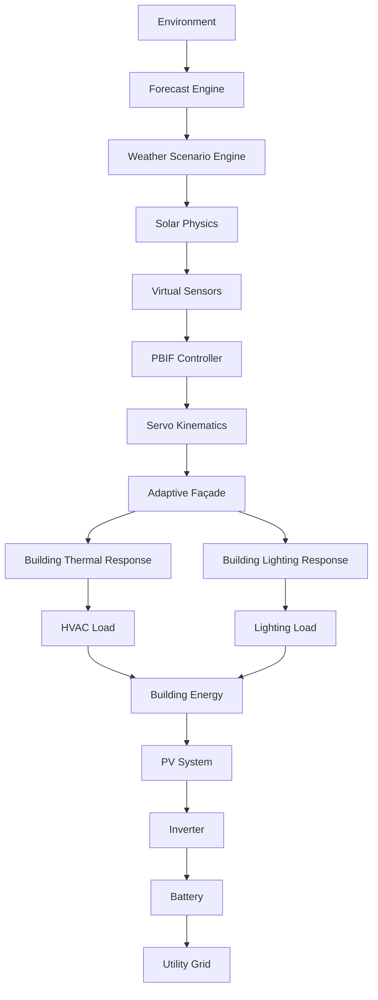

# SOLIS AI: Adaptive Façade Digital Twin

[](https://nextjs.org/)
[](https://www.typescriptlang.org/)
[](https://docs.pmnd.rs/react-three-fiber/getting-started/introduction)
[](https://www.espressif.com/)

SOLIS AI is a comprehensive, interactive digital twin of a smart building equipped with a dynamic adaptive façade. I designed this project to bridge the gap between static building automation and dynamic, predictive intelligence, providing measurable improvements in energy efficiency, visual comfort, and thermal regulation.

## Live Demo

**[Open the Live Digital Twin](INSERT_LIVE_VERCEL_URL_HERE)**

*(Replace the link above with the deployed Vercel URL before publishing.)*

## Project Overview

The goal of SOLIS is to model and optimize a building's physical interactions with its environment. It achieves this by coupling a real-time weather and solar physics engine with a physical façade model. As the virtual louvres rotate to track the sun or block heat, the system calculates the exact consequences on the building's thermal lag, HVAC cooling demand, daylight harvesting, and aggregate energy load.

The twin also features a virtual ESP32 embedded controller that mirrors the same priority-based control logic as the physical hardware prototype, demonstrating that the building intelligence I designed can run at the edge as well as in the cloud.

## Key Engineering Features

1. **Cyber-Physical Pipeline:** A continuous, deterministic simulation loop from weather generation to solar physics, sensor modeling, and servo kinematics.
2. **Predictive Building Intelligence Framework (PBIF):** A deterministic, four-tier safety-first priority engine that guarantees structural safety and weather protection always override energy optimization.
3. **Coupled Building Physics:** Real-time calculation of thermal mass lag, cooling load (HVAC), and daylight harvesting (artificial lighting offsets).
4. **Energy Microgrid Settlement:** Aggregates building demand and settles it against a simulated Rooftop PV array, Battery Energy Storage System (BESS), and the Utility Grid.
5. **AI Advisory Layer:** A strictly read-only AI layer that provides What-If scenario analysis, future load prediction, and deterministic fault detection without compromising the safety of the control loop.
6. **Edge Hardware Integration:** A digital replica of the physical ESP32 firmware's control logic running within the browser, alongside the actual C++ firmware source for the physical prototype.

## System Architecture



Every simulation tick walks this same pipeline, deterministically, from raw environmental drivers to a settled electrical balance. The [System Architecture](docs/architecture/system_overview.md) doc breaks down each stage; the [Cyber-Physical Pipeline](docs/architecture/cyber_physical_pipeline.md) doc goes deeper on the sensing → embedded-control → actuation slice specifically.

## Engineering Pipeline

This is the concept the whole project is built around: a single environmental change propagates, with real physics at every step, all the way to the building's electrical demand.

```
Environmental condition (sun, cloud, rain, wind)
  → PBIF decision (which priority tier fires)
  → façade blade angle
  → solar gain through the façade
  → building thermal response (envelope heat gain, thermal-mass lag)
  → HVAC cooling demand (electrical kW, via the cooling plant's COP)
  → daylight-driven lighting demand (electrical kW)
  → settled against PV generation, battery storage, and the utility grid
```

No stage short-circuits this chain — the façade doesn't just "look" different when the sun moves, it changes the electrical load the building actually has to serve.

## Engineering Documentation

I have thoroughly documented the engineering logic, mathematical equations, and architectural boundaries of this system. Explore the public documentation here:

- **[System Architecture](docs/architecture/system_overview.md)**
- **[Cyber-Physical Pipeline](docs/architecture/cyber_physical_pipeline.md)**
- **[PBIF & Kinematics](docs/facade/pbif_and_kinematics.md)**
- **[Thermal & Daylighting Models](docs/building-physics/thermal_and_daylighting.md)**
- **[Energy Load & Microgrid](docs/energy/energy_model.md)**
- **[Environment & Solar Physics](docs/simulation/environment.md)**
- **[Embedded ESP32 Firmware](docs/embedded/esp32_firmware.md)**
- **[AI Advisory Layer](docs/ai/ai_advisory_layer.md)**

## Running the Digital Twin Locally

To run the interactive Next.js simulation environment on your own machine:

1. Clone the repository
2. Install dependencies:
   ```bash
   npm install
   ```
3. Run the development server:
   ```bash
   npm run dev
   ```
4. Open [http://localhost:3000](http://localhost:3000) with your browser to see the result.

## Project Structure

- `src/app/`: Next.js App Router pages (Homepage, Engineering Lab, Twin UI).
- `src/components/`: React UI components and 3D Canvas elements.
- `src/lib/engine/`: The core physics and simulation engine (Solar, Thermal, Lighting, PV, Battery, Grid).
- `src/lib/pbif/`: The deterministic decision layer.
- `src/lib/kinematics/`: The analytic façade rotation solver PBIF calls into.
- `src/lib/vec/`: The Virtual Embedded Controller (browser-side port of the firmware's control logic).
- `src/lib/prediction/`, `src/lib/ai/`: The read-only AI advisory layer (Prediction, What-If, Fault Detection).
- `docs/`: The public engineering documentation linked above.
- `E&M Programming/`: The physical ESP32 C++ firmware (`sketch.ino`) and its Wokwi simulator project.

## Project Highlights

A few things I'd point to as the strongest engineering work in this project:

- I built a real-time digital twin that connects adaptive façade decisions all the way through to building thermal and electrical behaviour — a blade angle isn't cosmetic here, it changes a real electrical load.
- I implemented a priority-based façade controller (PBIF) that keeps structural safety and weather protection as hard, deterministic overrides, completely separate from energy-optimization logic — so the safety case never depends on a model behaving well.
- I coupled façade solar gain to HVAC cooling demand and daylight-responsive lighting demand through actual thermal-mass and photometric models, rather than treating the façade and the building's energy system as independent simulations.
- I kept the AI layer (prediction, what-if analysis, fault detection) strictly read-only and separate from the control loop, so I could add engineering intelligence on top of the twin without ever putting an unpredictable model in the safety-critical path.
- I built a physical ESP32 prototype and a browser-side twin of its control logic side by side, so the same priority hierarchy that runs in the cloud simulation also runs on real hardware.

## Technology Stack

Next.js (App Router) · TypeScript · React Three Fiber / Three.js · Zustand · Tailwind CSS · ESP32 (C++, Arduino framework) · MQTT · Open-Meteo API · Google Gemini (Engineering Assistant)
