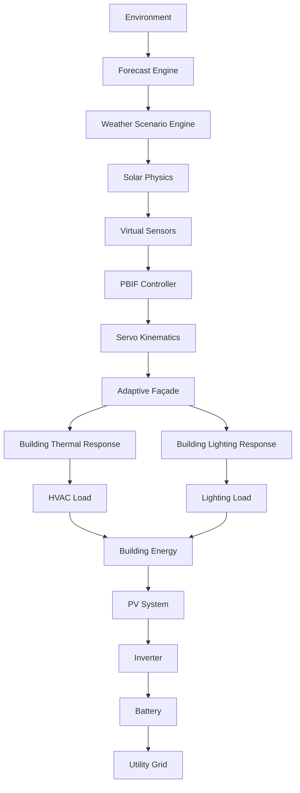

# System Architecture

I designed the SOLIS Digital Twin as a comprehensive cyber-physical pipeline. The system integrates an embedded ESP32 simulation running a Cyber-Physical Pipeline, alongside a Rooftop PV System and a Building Energy Management System, to evaluate and optimize physical interactions with environmental data.

## The Cyber-Physical Pipeline

My goal was to create a strictly coupled loop where a change in environmental conditions propagates deterministically through the entire building physics model. I structured the simulation so that:

1. **Environment & Weather Engine**: Interpolates environmental drivers over simulated time (either a playback scenario or a live forecast).
2. **Solar Physics**: Computes astronomical sun position, clear-sky irradiance, and incident vectors.
3. **Sensing**: Models physical LDR components and outputs realistic sensor readings based on raw irradiance.
4. **PBIF Controller**: The Predictive Building Intelligence Framework evaluates physical state against building objectives (structural safety, weather protection, solar optimization).
5. **Adaptive Façade**: Solves physical kinematics for the façade panels and actuates the servos.
6. **Building Physics**: Calculates the façade's solar gain, translating it into building envelope heat gain, indoor illuminance, and thermal lag.
7. **HVAC & Lighting**: Derives electrical cooling demand and artificial lighting demand from the building physics state.
8. **Energy Management**: Settles electrical demand against the Rooftop PV generation, Battery storage, and Utility Grid.

## Separation of Concerns

I enforced a strict separation between the deterministic control loop and the AI advisory layer. 

**The AI Advisory Layer** (Prediction, What-If Analysis, Fault Detection, and the Engineering Assistant) operates strictly as a read-only observer. I designed it to project the twin forward, evaluate hypothetical alternatives in a throwaway sandbox, and fuse static architecture intent with live context to produce structured explanations. It never actuates the façade.

**The PBIF Layer** remains the sole authority for façade control. By keeping PBIF deterministic and rule-based, I ensured the system could be reliably certified for structural safety without relying on unpredictable machine learning outputs in the critical path.

## Simulation Flow

Every simulation tick executes the following pipeline:

